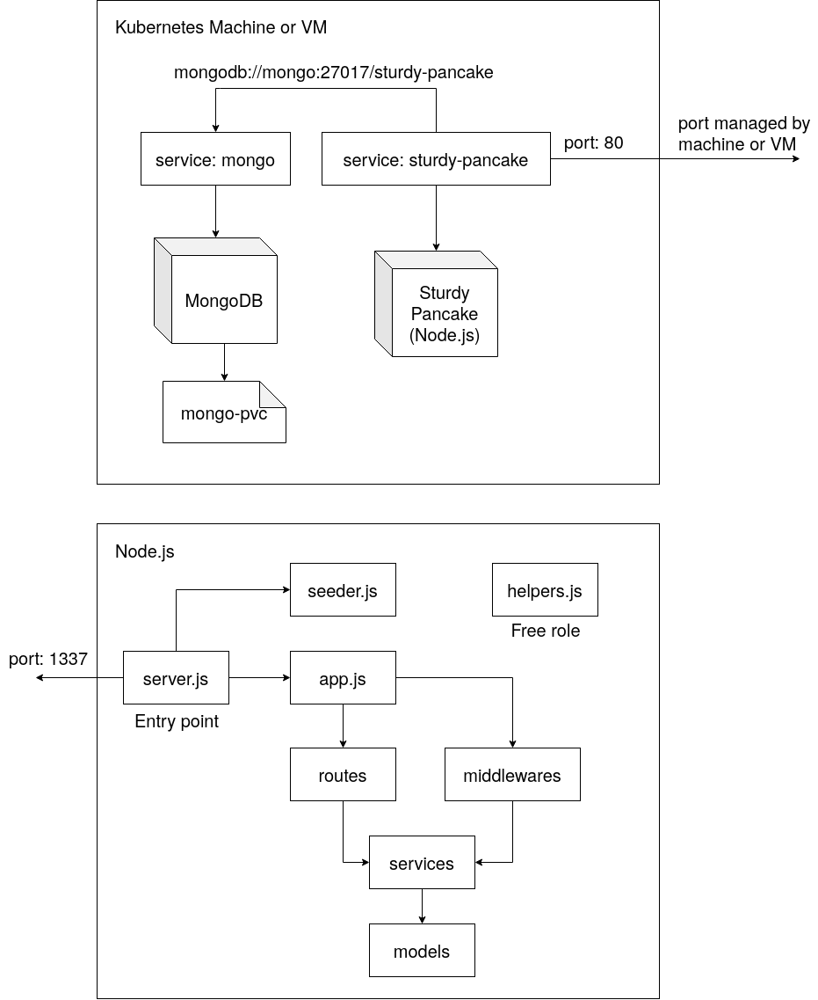

# Sejuta Cita REST API Test
> This is an app for SejutaCita submission.

## Architecture


## Getting Started
You can run this app with Kubernetes, Docker Compose or Manually on regular server. See all instructions below. After you run the app. Navigate to `/docs` path to see API documentation.

### Running on Kubernetes
Create random 32 characters string for app key.
```sh
openssl rand -base64 32
```

Change `generatedappkey` with random characters above and run it.
```sh
kubectl create secret generic app-secret --from-literal=secret-key='generatedappkey'
```

Run App and MongoDB kubes (see directory `kubes/`).
```sh
kubectl apply -f kubes
```

If you are in local, you can check the URL here and navigate to `/docs` path to see API docs.
```sh
minikube service sturdy-pancake --url
```

### Running with Docker Compose
Simply run this command:
```
docker-compose up -d
```

### Manual Run
Before you run it, please install all dependencies with Yarn.
```sh
yarn install
```

And then rename config file `.env.example` to `.env`. Edit those config with desired configuration.

Make sure MongoDB is already running.
```sh
systemctl start mongod
```

Run in development mode:
```sh
yarn dev
```

Run in production:
```
node server.js
```

## Testing
Make sure MongoDB is already running.
```sh
systemctl start mongod
```

Run tests:
```sh
yarn test
```
